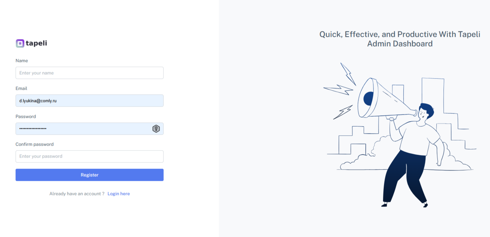
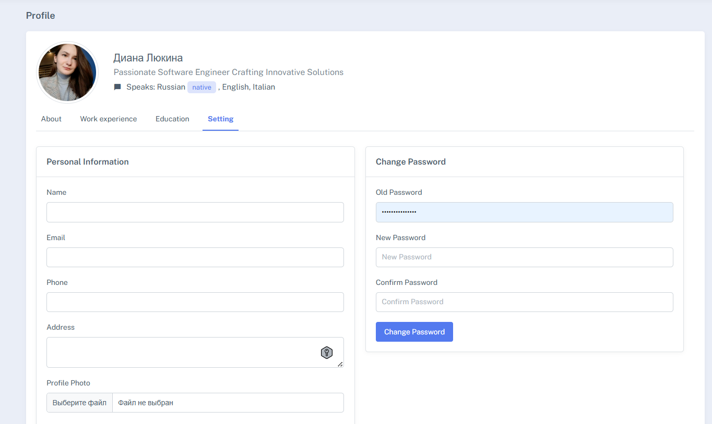
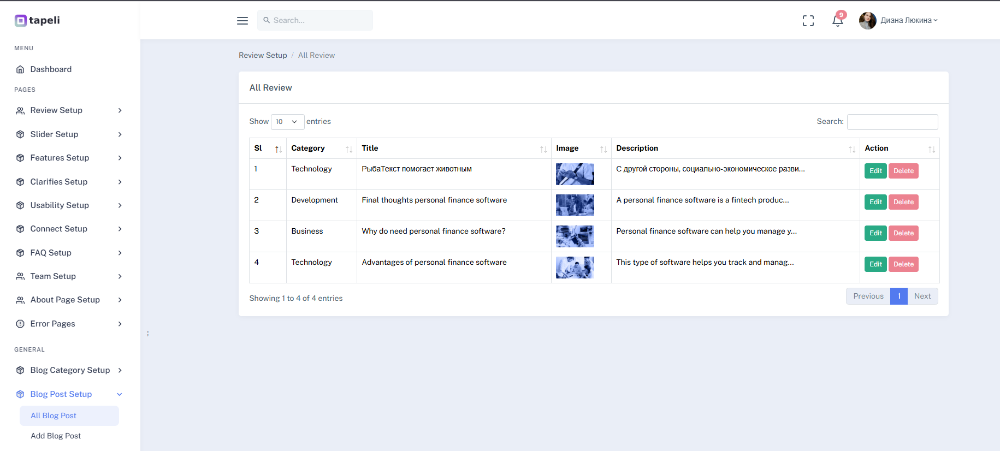
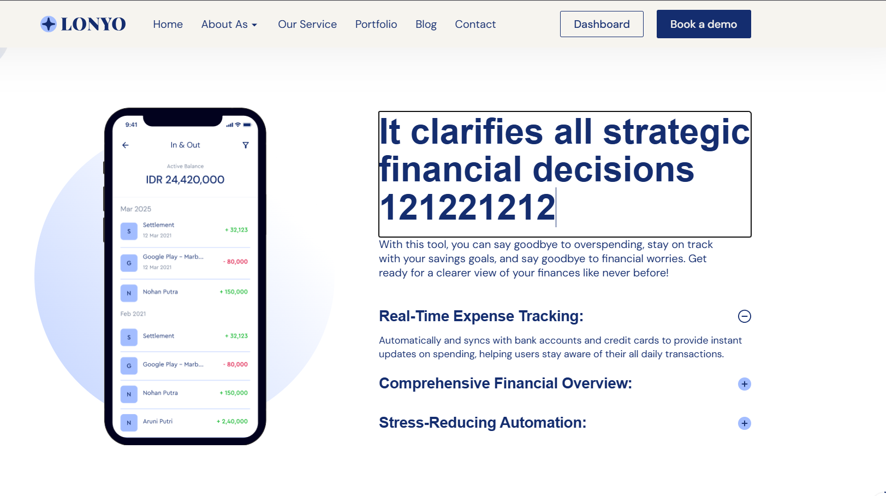

## О проекте

Представляет собой веб сайт, состоящего из публичной и административной частей, доступ к которому есть у зарегистрированных пользователей.

Возможности зарегистрированных пользователей:
- управление контентом из административной части и непосредственно на публичной части сайта
- просмотр 

На сайте реализовано:
1) Управление учетной записью
- регистрация
- двух-факторная аутентификация (через почту)
- изменение пароля

2) Управление контентом с административной части

3) Управление контентом на публичной части
